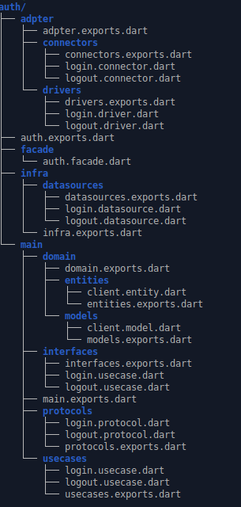

# clean_dart_module_creator

Dart Plugin to create structure with dart

## Getting Started

This project is a starting point for a Dart
[package](https://flutter.dev/developing-packages/),
a library module containing code that can be shared easily across
multiple Flutter or Dart projects.

For help getting started with Flutter, view our 
[online documentation](https://flutter.dev/docs), which offers tutorials, 
samples, guidance on mobile development, and a full API reference.


## Using in Project


- enter in project folder
- Edit pubsspec.yaml and insert code bellow in dev_dependencies:

```
clean_dart_module_creator:
    git:
      url: https://gitlab.com/RafaelSilvaPereira1/clean_dart_module_creator.git
      ref: master

```
- Enter in terminal in project 
- Run: `flutter pub get`
    - will log in to your gitlab account


- In lib
    - create folder:  `modules`
    - enter in modules
    - create fiile main.dart with code bellow.
```
import 'package:clean_dart_module_creator/clean_dart_module_creator.dart';
main(List<String> args) {
  execMain(args);
}
```

- In terminal in folder modules
    - execute `dart main.dart -m auth -e client -u login,logout`
    - will create a module called auth with use cases: login, logout. And with entities: client


## Parameters

| Command     	| Abrr 	| Usage          	| Required 	| COMMENT                                          	|
|-------------	|------	|----------------	|----------	|--------------------------------------------------	|
| --modules   	| -m   	| -m M1 	| YES      	| will create a module with the name: M1  	|
| --entities  	| -e   	| -e E1,E1,E3    	| YES      	| will create entities with the names: E1, E2, E3. 	|
| --usercases 	| -u   	| -u U1,U2,U3    	| YES      	| will create usercases with the names: U1, U2, U3 	|


## File Structure


The file structure follows the image below.
<p align="center">
  
</p>


- Adpter *: Responsible for communication between infra and main structures*
- Infra *: Responsible for importing external project libraries and settings*
- Main *: Responsible for the entities, DTO models and the business rules of the application*
  - Domain - Responsible by models in system.
  - interfaces - Have interfaces of usercases.
  - protocols - Responsible by comunitication between main and adapter.
  - entities - Responsible for basic class in system
  - models - Responsible for representing the presentation class. Usually in composition with entity.
  - facate - Reponsible by extern access in the module
